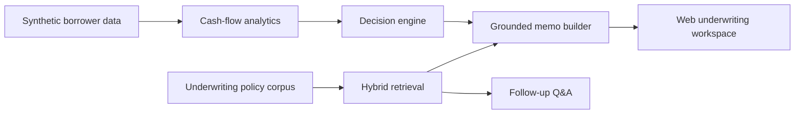

# FlowScore AI

FlowScore AI is an LLM-based underwriting workstation for SMB credit. It combines cash-flow analysis, receivables quality checks, and grounded policy retrieval to produce analyst-ready credit memos for working capital lines and invoice advances.

The repo ships with synthetic borrower files, internal underwriting policy documents, and a local retrieval stack, so the full system runs without external services.

## What the app does

- Scores applicants from transaction, invoice, and debt-service behavior
- Recommends decline, manual review, approval with reserve, or clean approval
- Sizes a facility or advance line from observed repayment capacity
- Generates a structured memo with policy-linked evidence
- Answers follow-up underwriting questions against the indexed policy corpus

## Product shape



## Main workflows

### 1. Underwrite a borrower

Pick one of the seeded applicants and run the analysis. The app returns:

- risk score
- DSCR
- runway
- customer concentration
- recurring revenue share
- overdue A/R
- decision memo
- monitoring plan

### 2. Ask a policy question

Use the follow-up panel to ask questions such as:

- Why does this borrower need a reserve?
- What would move this file onto the watchlist?
- Why is this invoice book not eligible for a higher advance rate?

### 3. Benchmark the retrieval layer

Run the built-in evaluation suite to measure retrieval quality on the underwriting corpus.

## Repo layout

```text
.
|-- data
|   |-- applicants
|   |-- corpus
|   `-- evaluation
|-- public
|   `-- assets
|-- src
|   |-- core
|   |   |-- retrievers
|   |   |-- applicants.ts
|   |   |-- answerer.ts
|   |   |-- evaluator.ts
|   |   |-- indexer.ts
|   |   |-- retrieval.ts
|   |   `-- underwriting.ts
|   |-- cli.ts
|   `-- server.ts
`-- tests
```

## Run locally

### Requirements

- Bun 1.3+

### Commands

```bash
bun run src/cli.ts build-index
bun run src/cli.ts list-applicants
bun run src/cli.ts underwrite atlas-growth
bun run src/cli.ts ask-applicant cedar-commerce "Why should this request be declined?"
bun run src/server.ts
```

Then open [http://localhost:3000](http://localhost:3000).

## API

### `GET /api/applicants`

Returns the seeded borrower set for the UI selector.

### `POST /api/underwrite`

Request body:

```json
{
  "applicantId": "atlas-growth"
}
```

Returns the decision, memo, metrics, signals, evidence, and retrieval trace.

### `POST /api/ask`

Request body:

```json
{
  "applicantId": "cedar-commerce",
  "query": "What policy signals justify a decline?"
}
```

Returns a grounded answer plus supporting source chunks.

### `GET /api/eval`

Runs retrieval evaluation on the included underwriting query set.

## Validation

Validation run in this workspace on April 8, 2026:

- `bun test`: 6 passing tests
- Indexed documents: 7
- Indexed chunks: 22
- Evaluation aggregate:
  - Recall@5 = 0.80
  - Recall@10 = 0.80
  - MRR@10 = 0.90
  - nDCG@10 = 0.78
  - Support rate = 0.67

## Notes

- All borrower files and policy documents are synthetic.
- The optional OpenAI-compatible synthesis hook still works through `.env.example`, but the repo runs locally without an external model.
- The system is built as analyst decision support, not autonomous credit approval.
