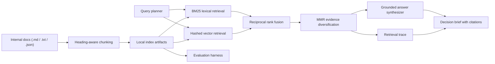

# Northstar Risk Desk

Northstar Risk Desk is a grounded intelligence layer for fintech risk, treasury, compliance, fraud, and payment operations teams. It ingests internal operating documents, retrieves the most relevant evidence with a hybrid search pipeline, and returns cited answers with confidence controls instead of free-form unsupported text.

The repository ships with a synthetic internal corpus so the full system runs locally without API keys or a hosted vector database. The architecture is intentionally modular: the retrieval stack works on its own, and stronger embedding or generation providers can be swapped in later without changing ingestion, ranking, or the UI.

## Product purpose

Northstar is designed for questions such as:

- Why did a control trip and what exactly triggered it?
- What changed in policy after a risk metric deteriorated?
- How should treasury, underwriting, and payment operations respond to the same incident?
- When should a merchant move into manual review or enhanced due diligence?

The included sample corpus covers:

- Treasury liquidity controls
- Merchant underwriting and reserve policy
- AML escalation and KYC refresh
- Fraud loss playbooks
- Same-day funding incident reviews
- BNPL credit policy changes
- Card routing strategy
- Weekly risk committee briefs

## System design



## Why the retrieval stack is built this way

### 1. Hybrid retrieval

Northstar combines:

- BM25 for exact operational language such as `ACH`, `EDD`, `rolling reserve`, `chargeback ratio`, and `warehouse utilization`
- A dependency-light hashed vector retriever for semantic recall when the user asks the right business question but not with the exact wording used in the source documents

This matters in fintech because internal documents mix acronyms, thresholds, policy names, and narrative explanations. Exact-match retrieval alone misses paraphrase. Semantic retrieval alone can miss the decisive operational term.

### 2. Query planning

The system plans multiple retrieval views before ranking:

- Original query
- Compressed query
- Domain expansion for acronyms like `ACH`, `AML`, `BNPL`, `EDD`, and `KYC`
- Intent priors for verbs such as `compare`, `monitor`, `respond`, `escalate`, and `assess`

That planning layer improves retrieval robustness while keeping the trace fully inspectable in the UI.

### 3. Fusion and evidence diversity

Northstar uses reciprocal rank fusion to merge heterogeneous retrievers without pretending their raw scores are calibrated to the same scale. It then applies maximal marginal relevance so the final evidence slate covers complementary parts of the operating story instead of repeating one chunk six times.

### 4. Grounded answering and abstention

The answer layer is evidence-first:

- It scores candidate answer sentences from the retrieved evidence
- It associates each sentence with chunk-level citations
- It warns and abstains when evidence is too weak

This is important for internal risk tooling. A system that always answers fluently is operationally worse than a system that sometimes refuses and points you back to the supporting evidence.

### 5. Evaluation

The repo includes a benchmark query set in [data/evaluation/queries.json](C:\Users\Zain\Desktop\RAGer\data\evaluation\queries.json). The evaluation harness reports:

- Recall@5
- Recall@10
- MRR@10
- nDCG@10
- Support rate

The answer metric is intentionally lightweight, but it is useful as a regression guard when changing retrieval logic, document structure, or prompt behavior.

## UI

The web UI is a control-room style workspace for analysts:

- Suggested briefing prompts
- Decision brief with confidence badge
- Supporting evidence cards
- Retrieval trace showing query variants and fused candidates
- Indexed document room
- Retrieval health panel with aggregate and per-query metrics

Main entrypoints:

- [src/server.ts](C:\Users\Zain\Desktop\RAGer\src\server.ts)
- [src/cli.ts](C:\Users\Zain\Desktop\RAGer\src\cli.ts)
- [src/core/retrieval.ts](C:\Users\Zain\Desktop\RAGer\src\core\retrieval.ts)
- [src/core/answerer.ts](C:\Users\Zain\Desktop\RAGer\src\core\answerer.ts)
- [src/core/query-planner.ts](C:\Users\Zain\Desktop\RAGer\src\core\query-planner.ts)

## Run locally

### Requirements

- Bun 1.3+

### Commands

```bash
bun run src/cli.ts build-index
bun run src/cli.ts ask "Why does treasury monitor warehouse utilization and settlement lag together?"
bun run src/cli.ts eval
bun test
bun run src/server.ts
```

Then open [http://localhost:3000](http://localhost:3000).

## Optional LLM synthesis

The system works without any external model provider. If you want model-based answer synthesis on top of the grounded retrieval stack, copy [.env.example](C:\Users\Zain\Desktop\RAGer\.env.example) and supply an OpenAI-compatible endpoint:

```bash
OPENAI_BASE_URL=
OPENAI_API_KEY=
OPENAI_MODEL=gpt-4o-mini
```

## API

### `GET /api/status`

Returns build time and index volume.

### `GET /api/documents`

Returns the indexed document list used by the UI.

### `POST /api/rebuild`

Rebuilds the local index from the corpus.

### `POST /api/ask`

Request body:

```json
{
  "query": "What conditions trigger a rolling reserve increase for a merchant?"
}
```

Response includes:

- grounded answer
- evidence chunks
- confidence
- warnings
- retrieval trace

### `GET /api/eval`

Runs the included retrieval benchmark and returns aggregate and per-query metrics.

## Current local validation

Validation run in this workspace on April 8, 2026:

- Indexed documents: 8
- Indexed chunks: 39
- `bun test`: 4 passing tests
- Evaluation aggregate:
  - Recall@5 = 1.00
  - Recall@10 = 1.00
  - MRR@10 = 1.00
  - nDCG@10 = 1.00
  - Support rate = 0.89

## Project layout

```text
.
|-- data
|   |-- corpus
|   `-- evaluation
|-- public
|   `-- assets
|-- src
|   |-- core
|   |   |-- retrievers
|   |   |-- answerer.ts
|   |   |-- evaluator.ts
|   |   |-- indexer.ts
|   |   |-- query-planner.ts
|   |   |-- ranking.ts
|   |   `-- retrieval.ts
|   |-- cli.ts
|   `-- server.ts
`-- tests
```

## Extension paths

1. Replace the hashed embedding provider with a stronger encoder.
2. Add a cross-encoder reranker on the fused candidate set.
3. Add explicit claim-to-citation verification.
4. Introduce document-level metadata filtering by team, region, or risk tier.
5. Persist the index in a remote vector store once the retrieval logic is stable.

## Notes on the sample data

The included corpus is synthetic and designed to emulate internal fintech operating documents closely enough for local evaluation and UI demonstration. That keeps the repo runnable without sensitive data while preserving the product shape and the retrieval challenges the system is meant to handle.
